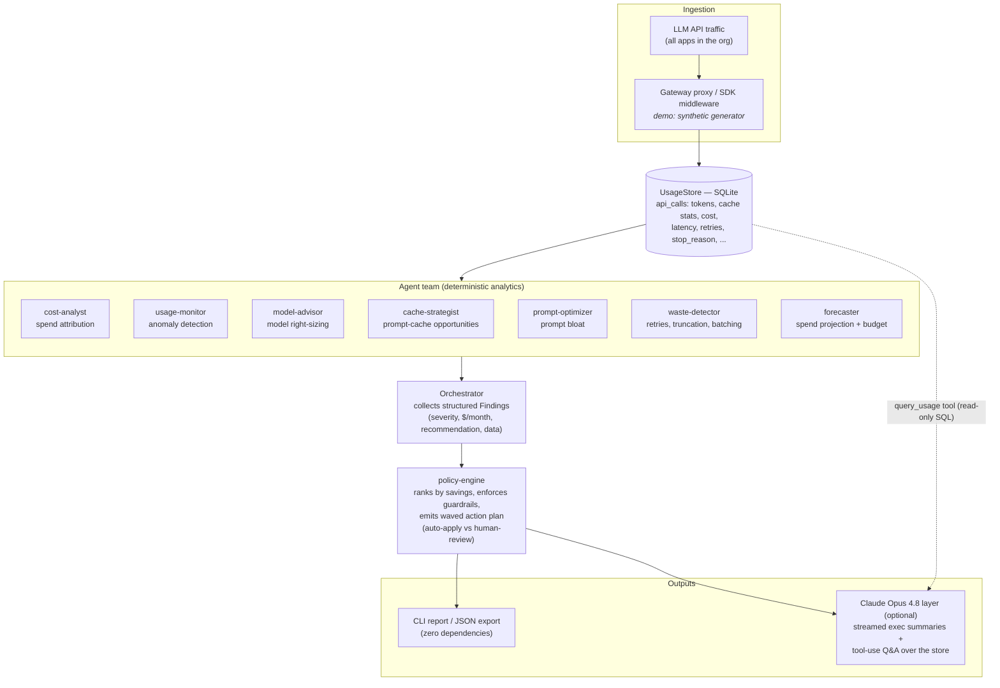

# TokenOps

A multi-agent system for LLM API cost management — the core engine for a SaaS
platform that acts like an intelligent operations team, not a dashboard. Eight
specialized agents continuously monitor usage, attribute spend, detect waste,
recommend cheaper models, find caching opportunities, forecast budgets, and
turn everything into a ranked, guardrailed action plan.

## Quick start

```bash
python3 -m tokenops demo                 # full agent run on 30 days of synthetic traffic
python3 -m tokenops demo --budget 4000   # adds budget-breach forecasting
python3 -m tokenops export findings.json # machine-readable findings

# Optional Claude reasoning layer (executive summaries + conversational Q&A):
pip install anthropic                    # then set ANTHROPIC_API_KEY or `ant auth login`
python3 -m tokenops demo --llm
python3 -m tokenops ask "Why is rag-search our top spend driver, and what do we do first?"
```

No dependencies are required for the core system — it runs on the Python
standard library. The `anthropic` package enables the LLM layer.

## The agent team

| Agent | Mission | Example finding |
|---|---|---|
| **cost-analyst** | Attribute every dollar to an app, model, and task | "rag-search is 40% of spend" |
| **usage-monitor** | Z-score anomaly detection on per-app daily spend | "eval-pipeline spiked 4σ on July 2" |
| **model-advisor** | Right-size models per workload | "support-bot runs 11-token classifications on Opus — move to Sonnet" |
| **cache-strategist** | Find repeated prompt prefixes billing at full price | "12k-token prefix re-sent 47k times uncached: $1,330/mo recoverable" |
| **prompt-optimizer** | Detect prompt bloat via input:output ratios | "45:1 ratio where 20:1 is typical — trim 30%" |
| **waste-detector** | Retry burn, truncated outputs, missed batch discounts | "40k latency-insensitive calls skipping the 50%-off Batches API" |
| **forecaster** | OLS trend projection + budget-breach alerts | "Projected $6,496 vs $4,000 budget — 62% over" |
| **policy-engine** | Rank actions by savings, enforce guardrails, emit plan | "Wave 1: top 3 actions, $2,254/mo; quality-sensitive apps never auto-downgraded" |

## Architecture



## How the system works

A run is a five-stage pipeline. In the demo every stage executes in one
command (`python -m tokenops demo`); in production stages 1 and 2–5 run on
independent schedules.

**1. Ingestion.** Every LLM API call the org makes is logged to the
`api_calls` table — model, input/output/cache tokens, latency, retry linkage,
stop reason, prompt-prefix hash, and the computed cost from
[pricing.py](tokenops/pricing.py)'s catalog (current per-MTok prices, the
~0.1x cache-read and 1.25x cache-write multipliers, the 50% batch discount).
The demo seeds ~195k calls over 30 days with realistic inefficiencies planted
(an uncached 12k-token RAG prefix, classifications on Opus, a retry storm, an
eval-sweep cost spike, truncated outputs, batch-eligible offline traffic).

**2. Analysis.** The orchestrator runs seven analyst agents against the
store. Each agent is a pure function of the data — SQL aggregation plus
pricing math, no LLM in the loop — so every number it produces is auditable
and reproducible. Examples: the cache-strategist finds prompt prefixes ≥1,024
tokens (the minimum cacheable size) that repeat with zero cache reads and
prices out what a `cache_control` breakpoint would save; the usage-monitor
z-scores each app's daily spend against its own baseline and flags ≥3σ days;
the forecaster fits a least-squares trend to daily spend and projects 30 days
forward against the budget.

**3. Findings.** Agents emit `Finding` objects — a severity
(critical/warning/info), an estimated monthly savings figure, a plain-English
detail and recommendation, and the underlying data. Findings are the system's
common currency: the CLI renders them, `export` serializes them for
dashboards, and the LLM layer reasons over them.

**4. Policy.** The policy-engine consumes every other agent's findings and
turns them into an execution plan: actions ranked by savings, classified
auto-apply (caching, batching, retry config — near-zero risk) vs human-review
(model changes), batched into waves of at most three concurrent changes so
regressions stay attributable. Guardrail: apps marked quality-sensitive are
never auto-downgraded — the model-advisor routes those as eval-gated
recommendations with $0 claimed savings until the eval passes.

**5. Reasoning (optional).** With Anthropic credentials present, Claude
Opus 4.8 sits on top as the team's lead analyst: it streams an executive
summary of the findings, and `tokenops ask "..."` gives it a `query_usage`
tool — a read-only SQL interface to the store — so it can investigate
questions the pre-computed findings don't answer (per-day breakdowns, "what
changed on the 2nd?"). The stable system prompt carries a prompt-caching
breakpoint, so repeated questions in a session bill the prefix at ~10% price.
The division of labor is strict: the deterministic layer computes the
numbers; Claude explains, prioritizes, and answers follow-ups grounded in
them.

**Design principles**

- **Deterministic core, LLM on top.** Every dollar figure comes from auditable
  SQL + pricing math, never from a model's imagination. Claude reads the
  findings and the store; it doesn't compute the numbers.
- **Findings are structured.** Each carries severity, an estimated monthly
  savings figure, a concrete recommendation, and the underlying data — so they
  can drive dashboards, alerts, or automation equally well.
- **Guardrails before automation.** Low-risk actions (caching, batching, retry
  config) are marked auto-apply; model downgrades route to human review, and
  quality-sensitive apps additionally require an eval gate. Changes ship in
  capped waves so regressions stay attributable.
- **Graceful degradation.** Without credentials, everything except the LLM
  synthesis still works.

## Toward a SaaS platform

The pieces this scaffold is designed to grow into:

1. **Ingestion** — replace the synthetic seeder with a gateway proxy or SDK
   middleware that logs every LLM call (the `api_calls` schema already models
   what you'd capture), plus provider usage/cost API pollers for reconciliation.
2. **Multi-tenancy** — org/workspace scoping on the store; per-tenant budgets
   and policies.
3. **Continuous operation** — agents run on schedules (monitor: minutes;
   analyst/advisor: daily; forecaster: weekly) with findings deduplicated
   across runs and lifecycle-tracked (open → acknowledged → resolved).
4. **Actuation** — the policy engine's auto-apply actions become gateway config
   changes (routing rules, cache headers, batch redirection) behind feature
   flags; the eval gate becomes a real offline A/B harness.
5. **Surface** — web dashboard over the findings JSON, Slack/email alerts for
   critical findings, and the `ask` endpoint as an embedded copilot.
6. **Hosted agents** — the Claude layer can graduate from a single synthesis
   call to Anthropic Managed Agents for long-running investigation sessions.

## Project layout

```
tokenops/
├── pricing.py          # model catalog, cache/batch multipliers, cost math
├── store.py            # SQLite usage store + synthetic traffic generator
├── orchestrator.py     # runs the team, aggregates + renders findings
├── llm.py              # Claude Opus 4.8 layer: summaries, tool-use Q&A
├── cli.py              # demo / ask / export commands
└── agents/
    ├── base.py         # Agent + Finding abstractions
    ├── cost_analyst.py
    ├── usage_monitor.py
    ├── model_advisor.py
    ├── cache_strategist.py
    ├── prompt_optimizer.py
    ├── waste_detector.py
    ├── forecaster.py
    └── policy_engine.py
```
